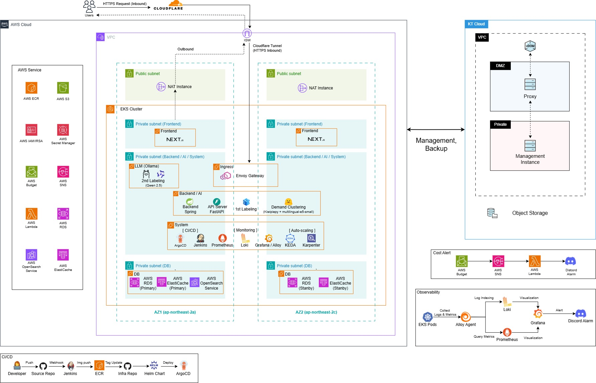

# MoongCheap-Cloud

KT Cloud TECH UP 통합 프로젝트 2팀(브이) MoongCheap 클라우드 인프라 Repository.

Frontend / Backend / AI 애플리케이션 코드는 각 서비스 Repository에서 관리하며, 이 Repository는 **AWS 인프라(Terraform)** 와 **Kubernetes 배포·GitOps(Helm + ArgoCD)** 를 관리한다.

---

## 1. 아키텍처 개요

AWS를 Primary Cloud로 애플리케이션·데이터 계층을 운영하고, KT Cloud는 AWS 인프라의 Terraform 기반 Open/Close 작업을 수행하는 관리 환경 및 백업 이중화용 Storage를 제공하는 Secondary Cloud로 사용한다.



> 상세 구성 요소·Worker Node 배치·Security Group 등은 [`docs/cloud_infra_architecture_V2.md`](./docs/cloud_infra_architecture_V2.md) 참고.

### 핵심 구성

| 영역 | 구성 |
| --- | --- |
| 진입점 | User → Cloudflare(DNS/Tunnel) → IGW → Envoy Gateway(Ingress, EKS System) |
| 네트워크 | AWS VPC — Public Subnet(NAT) / Private Subnet(Frontend, Backend·AI·System, DB) × AZ1(`ap-northeast-2a`) / AZ2(`ap-northeast-2c`) |
| 컴퓨트 — Frontend | Next.js (FE Worker, Private Subnet) |
| 컴퓨트 — Backend/AI | Backend(Spring), API Server(FastAPI) — 1st Labeling, Demand Clustering(Kiwipiepy + multilingual-e5-small) |
| 컴퓨트 — LLM | Ollama 기반 2nd Labeling(Qwen 2.5) |
| 컴퓨트 — System | ArgoCD·Jenkins·Prometheus(CI/CD) · Loki·Grafana/Alloy(Monitoring) · KEDA·Karpenter(Auto-scaling) |
| 데이터 | RDS(Primary/Standby), ElastiCache(Primary/Standby), OpenSearch — AZ1/AZ2 이중화, S3(Object) / ECR / Secrets Manager / IAM-IRSA |
| CI/CD | Developer → Source Repo(Webhook) → Jenkins(Img push) → ECR(Tag Update) → Infra Repo/Helm Chart → ArgoCD(Deploy) |
| Observability | EKS Pods → Alloy Agent → Loki(Log)/Prometheus(Metric) → Grafana(시각화) → Discord Alarm |
| 비용 관리 | AWS Budget → SNS → Lambda → Discord Alarm |
| Secondary Cloud | KT Cloud — Proxy(DMZ)·Management Instance(Private)로 AWS 관리(Terraform), Object Storage로 백업 이중화 |

---

## 2. Repository 구조

```text
MoongCheap-Cloud/
├── terraform/          # AWS(+KT Cloud) 인프라 프로비저닝
│   ├── modules/         # VPC, EKS, RDS, S3, IAM, Karpenter 등 재사용 모듈
│   ├── envs/             # develop / prod 환경별 루트 구성
│   ├── bootstrap/        # Terraform State 백엔드(S3/DynamoDB) 부트스트랩
│   └── scripts/          # 운영 보조 스크립트 (Karpenter pre-destroy 등)
│
├── gitops/              # Kubernetes 배포 및 ArgoCD 기반 GitOps 구성
│   ├── charts/            # 공통 Helm Chart (moongcheap-service)
│   ├── values/             # base → env → services → overrides Layering
│   ├── platform/           # 클러스터 공통 Platform (monitoring, keda, envoy-gateway 등)
│   ├── argocd/              # AppProject / ApplicationSet
│   └── README.md            # GitOps 구조 상세 문서
│
└── docs/                # 인프라 설계·운영 문서
    ├── cloud_infra_architecture_V2.md   # 아키텍처 설계서 (Source of Truth)
    ├── cloud-infra-git-convention.md    # Git / PR / 브랜치 컨벤션
    ├── naming_convention_V2.md          # 리소스 네이밍 규칙
    ├── cost-estimation-v3.md            # 비용 산정
    └── cost-management-runbook_V2.md    # 비용 운영 Runbook
```

---

## 3. IaC 역할 분리

| 도구 | 관리 대상 |
| --- | --- |
| **Terraform** | AWS Cloud Infrastructure (VPC/Subnet/EKS/Node Group/IAM/RDS/S3/Secrets Manager 등) — 단일 Source of Truth |
| **Helm + ArgoCD** | Kubernetes 내부 리소스 (Deployment, Service, HPA, HTTPRoute, Observability/CI-CD 구성 등) — GitOps로 동기화 |
| **Jenkins** | CI 파이프라인 (Build / Test / Docker Image / ECR Push) |

Terraform과 Kubernetes(Helm/ArgoCD) 관리 범위는 서로 중복되지 않도록 명확히 분리한다. 상세 기준은 [`docs/cloud_infra_architecture_V2.md`](./docs/cloud_infra_architecture_V2.md) §8, GitOps 구조는 [`gitops/README.md`](./gitops/README.md) 참고.

### 환경 (develop / prod)

- 동일 EKS 클러스터 내에서 `moongcheap-develop` / `moongcheap-prod` Namespace로 애플리케이션 환경을 분리한다.
- Terraform은 `terraform/envs/develop`, `terraform/envs/prod`로 환경별 루트 구성을 분리 관리한다.
- ArgoCD ApplicationSet도 `applicationset-services-develop` / `applicationset-services-prod`로 분리하며, `develop` / `main` 브랜치와 각각 매핑된다.

---

## 4. 기술 스택

- **Cloud**: AWS (`ap-northeast-2`, Multi-AZ), KT Cloud (Secondary — Terraform 관리 환경(Proxy/Management Instance) / Object Storage 백업)
- **Compute / Orchestration**: EKS, Karpenter (BE·AI Worker Autoscaling)
- **Networking**: Cloudflare (DNS/Tunnel), Envoy Gateway (Gateway API), NAT Instance
- **Data**: RDS PostgreSQL(Primary/Standby), ElastiCache Redis(Primary/Standby), OpenSearch, S3
- **AI / LLM**: Ollama(Qwen 2.5) — 2nd Labeling, Kiwipiepy + multilingual-e5-small — 1st Labeling/Demand Clustering
- **IaC**: Terraform
- **CI/CD**: Jenkins, ECR, ArgoCD (GitOps)
- **Autoscaling**: Karpenter, KEDA
- **Observability**: Prometheus, Loki, Grafana, Alloy
- **비용 / 알림**: AWS Budget, SNS, Lambda, Discord

---

## 5. 기여 가이드

브랜치 전략, 커밋/PR 컨벤션, 리뷰·머지 규칙은 [`docs/cloud-infra-git-convention.md`](./docs/cloud-infra-git-convention.md)를 따른다.

리소스 네이밍 규칙은 [`docs/naming_convention_V2.md`](./docs/naming_convention_V2.md) 참고.

---

## 6. 문서

| 문서 | 내용 |
| --- | --- |
| [`docs/cloud_infra_architecture_V2.md`](./docs/cloud_infra_architecture_V2.md) | 전체 아키텍처 설계서 (네트워크, EKS, AI 워크로드, 데이터 계층, IaC 구성) |
| [`docs/cloud-infra-git-convention.md`](./docs/cloud-infra-git-convention.md) | Git / PR 컨벤션 |
| [`docs/naming_convention_V2.md`](./docs/naming_convention_V2.md) | 리소스 네이밍 규칙 |
| [`docs/cost-estimation-v3.md`](./docs/cost-estimation-v3.md) | 비용 산정 |
| [`docs/cost-management-runbook_V2.md`](./docs/cost-management-runbook_V2.md) | 비용 운영 Runbook |
| [`gitops/README.md`](./gitops/README.md) | GitOps / Helm / ArgoCD 구조 상세 |
