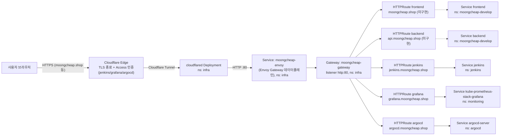
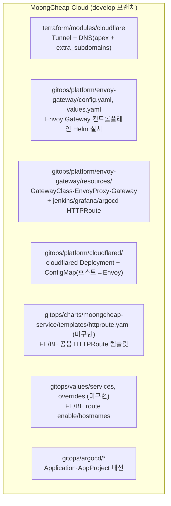

# Envoy Gateway / Gateway API 가이드

이 문서는 MoongCheap이 Ingress(nginx) 대신 **Kubernetes Gateway API + Envoy Gateway**로
외부 트래픽을 받는 구조를 설명한다. DEC-7(팀장님 정리본) 및 `docs/naming_convention_V2.md`
13절 항목 12("Gateway API 전환 여부 및 구현체")의 결정 사항을 구현한 결과물이다.

로컬 k8s 환경(`ccmall.shop` 도메인, K8s 1.29)에서 먼저 동작을 검증한 뒤, 실제
EKS(1.36) + `moongcheap.shop` 도메인 기준으로 `feat/enovy-gateway`에서 인프라 파트가
구현했다. **moongcheap-service 차트(FE/BE/AI가 쓰는 공용 Helm 차트)와 FE/BE/AI 각
서비스의 라우트 등록은 이번 작업 범위에 포함되지 않았다** — 3절 "동작 방식"은 이미
구현된 부분, 4절 "새 서브도메인 추가"는 앞으로 누구나 따라야 할 절차, 5절 "TODO"는
FE/BE/AI 쪽에서 직접 반영해야 하는 남은 작업이다.

---

## 1. 왜 바꿨나

- `ingress-nginx` 프로젝트가 서비스를 종료하면서, 신규 구축 시점에 legacy Ingress보다
  Kubernetes 표준인 Gateway API로 바로 가는 게 낫다고 판단함 (`docs/cloud_infra_architecture_V2.md`
  142행, 150행 참고).
- Gateway API는 스펙일 뿐이고 실제로 트래픽을 처리하는 구현체(컨트롤러)가 필요한데,
  ALB를 안 쓰는 현재 구조(EKS 내부에서 자체 처리)에 맞춰 **Envoy Gateway**를 선택함.
- ArgoCD 기반 GitOps로 배포 상태를 관리하는 기존 팀 컨벤션(`gitops/README.md`)을 그대로 따른다.

## 2. 전체 흐름



점선(HR1/HR2 → S1/S2)은 아직 구현되지 않은 부분이다 — 5절 참고.

핵심 포인트: **DNS/TLS/터널 연결은 Cloudflare가, 클러스터 안쪽 라우팅은 전부 Gateway API가**
담당한다. Cloudflare 쪽 설정과 클러스터 쪽 설정은 서로 다른 곳에 있고, 새 서브도메인을
추가할 때는 양쪽을 다 건드려야 한다 (4절 참고).

TLS는 Cloudflare Edge에서만 종료한다. 클러스터 내부(cloudflared → Envoy Gateway → 각
Service)는 전부 평문 HTTP다. 그래서 ArgoCD server도 `server.insecure: true`로 돌린다
(이미 반영됨).

## 3. 동작 방식 — 컴포넌트별 역할과 구현 위치

| 컴포넌트 | 역할 | 구현 위치 | 상태 |
| --- | --- | --- | --- |
| Cloudflare Tunnel + DNS 레코드 | 도메인을 뜨고, 클러스터로 들어오는 암호화 터널을 개설 | Terraform (`terraform/modules/cloudflare`) | ✅ `develop`에 이미 있음 (PR #37) |
| cloudflared (in-cluster) | 터널의 반대쪽 끝. 호스트별로 어느 클러스터 내부 서비스로 넘길지 결정 | GitOps (`gitops/platform/cloudflared`) | ✅ 구현 완료 |
| Envoy Gateway (컨트롤플레인) | GatewayClass/Gateway/HTTPRoute를 보고 실제 Envoy 데이터플레인을 만들어줌 | GitOps (`gitops/platform/envoy-gateway`, Helm) | ✅ 구현 완료 |
| GatewayClass / EnvoyProxy / Gateway | "이 클러스터에 Envoy Gateway라는 구현체가 있고, 80포트로 트래픽을 받는다"는 선언 | GitOps (`gitops/platform/envoy-gateway/resources`) | ✅ 구현 완료 |
| jenkins/grafana/argocd HTTPRoute | 플랫폼 컴포넌트 3개의 라우팅 규칙 | GitOps (`gitops/platform/envoy-gateway/resources/httproute-*.yaml`) | ✅ 구현 완료 |
| frontend/backend HTTPRoute | FE/BE 라우팅 규칙 | `moongcheap-service` 차트 + `gitops/values/` | ❌ 미구현 — 5절 TODO |
| Cloudflare Access | jenkins/grafana/argocd 앞단 로그인 인증 | Cloudflare 대시보드 (콘솔 작업) | ⏳ 코드 관리 대상 아님, 별도 진행 필요 |

### 3.1 파일 맵



| 경로 | 내용 |
| --- | --- |
| `terraform/modules/cloudflare/main.tf` | Tunnel 리소스 + apex DNS + `extra_subdomains` 리스트로 나머지 DNS 레코드 생성 |
| `terraform/envs/develop/main.tf` | 위 모듈을 실제로 호출. `extra_subdomains = ["api", "jenkins", "grafana", "argocd"]` |
| `terraform/envs/develop/outputs.tf` | `cloudflare_tunnel_token` — cloudflared Secret 만들 때만 쓰고 **절대 커밋 금지** |
| `gitops/platform/envoy-gateway/config.yaml` | `docker.io/envoyproxy`의 `gateway-helm` 차트로 Envoy Gateway 컨트롤플레인 설치 |
| `gitops/platform/envoy-gateway/values.yaml` | 컨트롤플레인 Deployment 리소스/replica/nodeSelector |
| `gitops/platform/envoy-gateway/resources/gatewayclass.yaml` | `GatewayClass moongcheap` |
| `gitops/platform/envoy-gateway/resources/envoyproxy.yaml` | 데이터플레인(Envoy) Deployment/Service 설정. Service 이름을 `moongcheap-envoy`로 고정 |
| `gitops/platform/envoy-gateway/resources/gateway.yaml` | `Gateway moongcheap-gateway`, listener `http:80`, 모든 네임스페이스의 HTTPRoute 허용 |
| `gitops/platform/envoy-gateway/resources/httproute-*.yaml` | 플랫폼 컴포넌트(jenkins/grafana/argocd)용 HTTPRoute |
| `gitops/platform/cloudflared/` | cloudflared Deployment + ConfigMap(5개 호스트 → `moongcheap-envoy` 매핑) |
| `gitops/argocd/application-gateway-resources.yaml` | `resources/` 디렉터리를 배포하는 standalone Application |
| `gitops/argocd/application-cloudflared.yaml` | `cloudflared/` 디렉터리를 배포하는 standalone Application |
| `gitops/argocd/projects/platform-project.yaml` | `infra`/`argocd` 네임스페이스, `docker.io/envoyproxy` 소스 허용 |
| `gitops/platform/argocd/values.yaml` | `server.insecure: true` — TLS는 Edge에서만 종료하므로 필요 |

### 3.2 현재 등록된 호스트 (5개)

| 호스트 | 대상 | Service | 상태 |
| --- | --- | --- | --- |
| `moongcheap.shop` | Frontend | `frontend` (ns: moongcheap-develop, 예정) | ❌ HTTPRoute 미구현 |
| `api.moongcheap.shop` | Backend | `backend` (ns: moongcheap-develop, 예정) | ❌ HTTPRoute 미구현, 호스트 vs 경로 결정도 미확정 |
| `jenkins.moongcheap.shop` | Jenkins | `jenkins` (ns: jenkins) | ✅ Cloudflare Access는 별도 설정 필요 |
| `grafana.moongcheap.shop` | Grafana | `kube-prometheus-stack-grafana` (ns: monitoring) | ✅ Cloudflare Access는 별도 설정 필요 |
| `argocd.moongcheap.shop` | ArgoCD | `argocd-server` (ns: argocd) | ✅ Cloudflare Access는 별도 설정 필요 |

cloudflared ConfigMap(`gitops/platform/cloudflared/configmap.yaml`)에는 5개 호스트가
전부 이미 등록되어 있다 — 즉 Cloudflare → cloudflared → Envoy Gateway까지는 5개 다
뚫려 있고, frontend/backend는 Envoy Gateway가 받은 다음 보낼 HTTPRoute가 없어서
404(Gateway API 기본 응답)가 나는 상태다.

## 4. 새 서브도메인을 추가하려면

예: `newapp.moongcheap.shop`을 새 서비스로 연결한다고 하면.

1. **Cloudflare DNS (Terraform)** — `terraform/envs/develop/main.tf`의
   `module.cloudflare.extra_subdomains`에 `"newapp"` 추가 → `terraform apply`.
   (apex 포함 1단계 서브도메인만 Universal SSL이 자동 적용된다. `foo.bar.moongcheap.shop`
   같은 2단계는 별도 인증서 처리가 필요하니 쓰지 않는다 — `terraform/envs/develop/main.tf`
   주석 C-12/J-3/DEC-3 참고.)

2. **cloudflared 라우팅 표** — `gitops/platform/cloudflared/configmap.yaml`의
   `ingress:` 목록에 아래 항목 추가 (항상 `moongcheap-envoy`로 넘기고, 실제 서비스 구분은
   HTTPRoute가 함):
   ```yaml
   - hostname: newapp.moongcheap.shop
     service: http://moongcheap-envoy.infra.svc.cluster.local:80
   ```

3. **HTTPRoute 추가**
   - `moongcheap-service` 차트를 쓰는 FE/BE/AI 서비스라면 (5절 TODO가 먼저 끝나 있어야
     함) 새 Terraform/GitOps 코드를 안 짜도 됨 — 해당 서비스의
     `gitops/values/services/<service>.yaml`에 `route.gateway`를,
     `gitops/values/overrides/<environment>/<service>.yaml`에 `route.enabled: true` +
     `route.hostnames: ["newapp.moongcheap.shop"]`만 추가.
   - 그 외 플랫폼 컴포넌트(Jenkins/Grafana/ArgoCD처럼 moongcheap-service 차트를 안 쓰는
     것)라면 `gitops/platform/envoy-gateway/resources/httproute-<이름>.yaml`을 새로
     만들어서 기존 `httproute-jenkins.yaml` 등을 그대로 복사 → hostname/namespace/
     backendRef만 바꾸면 됨. 아래 7절 패턴을 반드시 따를 것 (OutOfSync 방지).

4. **AppProject 확인** — 새 서비스가 지금 안 쓰이는 네임스페이스에 배포된다면
   `gitops/argocd/projects/platform-project.yaml`(플랫폼) 또는
   `services-project.yaml`(서비스)의 `destinations`에 그 네임스페이스를 추가해야 함.

5. **커밋 순서**: HTTPRoute → cloudflared ConfigMap → Terraform(DNS) 순으로 적용하면
   된다. 클러스터 안쪽(HTTPRoute, cloudflared 라우팅 표)을 먼저 다 준비해두고 DNS를
   가장 마지막에 켜야, 외부에 도메인이 노출되는 순간 이미 라우팅이 전부 완성된
   상태라 "도메인은 열렸는데 아직 안 뚫린" 구간이 생기지 않는다.

## 5. TODO — FE / BE / AI 쪽에서 반영해야 하는 것

이번 작업(인프라 파트, `feat/enovy-gateway`)에는 아래 내용이 **포함되지 않았다**.
`moongcheap-service` 차트와 `gitops/values/` 쪽 담당자가 별도 PR로 반영해야 한다.

### 5.1 `moongcheap-service` 공용 차트 — Ingress → HTTPRoute 전환

- `gitops/charts/moongcheap-service/templates/ingress.yaml` 삭제
- 같은 위치에 `templates/httproute.yaml` 신규 추가:
  ```yaml
  {{- if .Values.route.enabled }}
  apiVersion: gateway.networking.k8s.io/v1
  kind: HTTPRoute
  metadata:
    name: {{ include "moongcheap-service.fullname" . }}
    labels:
      {{- include "moongcheap-service.labels" . | nindent 4 }}
  spec:
    hostnames:
      {{- range .Values.route.hostnames }}
      - {{ . | quote }}
      {{- end }}
    parentRefs:
      - group: gateway.networking.k8s.io
        kind: Gateway
        name: {{ .Values.route.gateway.name }}
        namespace: {{ .Values.route.gateway.namespace }}
    rules:
      - matches:
          - path:
              type: PathPrefix
              value: /
        backendRefs:
          - group: ""
            kind: Service
            name: {{ include "moongcheap-service.fullname" . }}
            port: {{ .Values.service.port }}
            weight: 1
  {{- end }}
  ```
  `parentRefs`/`backendRefs`/`matches` 필드를 전부 명시한 이유는 7절 참고 (안 그러면
  ArgoCD가 계속 OutOfSync로 표시됨).
- `gitops/charts/moongcheap-service/values.yaml`의 `ingress:` 블록을 아래로 교체:
  ```yaml
  route:
    enabled: false
    gateway:
      name: ""
      namespace: ""
    hostnames: []
  ```
- `gitops/values/base.yaml`에 남아있는 `ingress: {enabled: false}` 키 삭제 (더 이상
  쓰이지 않는 죽은 키).

### 5.2 Frontend — `moongcheap.shop`

- `gitops/values/services/frontend.yaml`에 추가 (develop/prod 공용 — Gateway 포인터만):
  ```yaml
  route:
    gateway:
      name: moongcheap-gateway
      namespace: infra
  ```
- `gitops/values/overrides/develop/frontend.yaml`에 추가 (develop 환경 전용):
  ```yaml
  route:
    enabled: true
    hostnames:
      - moongcheap.shop
  ```
  **주의**: 도메인은 반드시 `services/frontend.yaml`이 아니라 `overrides/develop/frontend.yaml`에
  넣을 것. `services/frontend.yaml`은 develop·prod ApplicationSet이 공유하는 파일이라,
  여기에 넣으면 나중에 `main`으로 넘어갈 때 prod가 같은 도메인을 물려받아 충돌한다.

### 5.3 Backend — `api.moongcheap.shop`

- 위 frontend와 동일한 패턴으로 `gitops/values/services/backend.yaml` +
  `gitops/values/overrides/develop/backend.yaml`에 `route` 추가, hostnames는
  `api.moongcheap.shop`.
- **미확정 사항**: "호스트 vs 경로" 라우팅 방식이 아직 확정되지 않았다. 호스트 기반
  (`api.moongcheap.shop`, 위 패턴 그대로)으로 갈지, 경로 기반(예: `moongcheap.shop/api`,
  `httproute.yaml`의 `matches.path`를 `/api`로, hostnames를 frontend와 동일하게 바꿔야 함)
  으로 갈지 결정 후 반영할 것.

### 5.4 AI — 반영 불필요

- DEC-3(내부 전용)에 따라 외부 라우트를 안 만든다. 차트 기본값(`route.enabled: false`)이
  그대로 맞으므로 `gitops/values/services/ai.yaml`, overrides 쪽 다 손댈 필요 없음.

### 5.5 실제 배포 후 재확인 필요 (인프라 파트 쪽에도 해당)

- `jenkins`, `argocd-server` Service 이름이 실제 Helm 릴리스 이름과 일치하는지
  `kubectl get svc -n jenkins`, `kubectl get svc -n argocd`로 확인. 다르면
  `httproute-jenkins.yaml` / `httproute-argocd.yaml`의 `backendRefs.name` 수정.
- `gitops/platform/cloudflared/deployment.yaml`의 `cloudflare/cloudflared:latest` 이미지
  태그를 실제 최신 안정 버전으로 고정.
- ArgoCD `server.insecure: true`(`gitops/platform/argocd/values.yaml`)는 git에는
  반영됐지만, ArgoCD 자신의 Helm 릴리스를 업그레이드하는 수동 작업(`helm upgrade`)이
  한 번 필요할 수 있음 — ArgoCD 최초 설치 담당자 확인.

## 6. 이 문서/PR 범위 밖인 것

- **Cloudflare Access(로그인 인증)**: jenkins/grafana/argocd를 Access 정책 뒤에 두는 것,
  jenkins의 `/github-webhook/`만 bypass하는 정책은 전부 Cloudflare 대시보드에서 수동으로
  설정한다. 이 저장소의 Terraform/GitOps 코드로 관리하지 않는다.
- **prod(main) 반영**: 이번 작업은 `develop` 브랜치, `moongcheap-develop` 네임스페이스
  기준이다. prod에 같은 구조를 적용할 때는 `moongcheap.shop`을 그대로 재사용하면 안
  되고(도메인 충돌), prod용 도메인이 정해진 뒤 `gitops/values/overrides/prod/*.yaml`에
  따로 채워야 한다.

## 7. HTTPRoute 작성 시 주의할 점 (OutOfSync 방지)

Kubernetes API 서버가 `parentRefs[].group/kind`, `backendRefs[].group/kind/weight`,
`rules[].matches` 같은 선택 필드에 기본값을 채워 넣는데, Git에 있는 매니페스트가 이 값을
명시하지 않으면 ArgoCD가 "서버 상태 ≠ Git 상태"로 착각해서 계속 OutOfSync로 표시된다
(로컬 테스트에서 실제로 겪은 문제). 그래서 이 저장소의 모든 HTTPRoute는 아래 필드를
**항상 명시**한다 — 새로 만들 때도 이 패턴을 그대로 따를 것:

```yaml
parentRefs:
  - group: gateway.networking.k8s.io
    kind: Gateway
    name: moongcheap-gateway
    namespace: infra
rules:
  - matches:
      - path:
          type: PathPrefix
          value: /
    backendRefs:
      - group: ""
        kind: Service
        name: <service-name>
        port: <port>
        weight: 1
```

## 8. 참고 — 로컬 테스트 환경과 다른 점

| 항목 | 로컬 테스트 (ccmall.shop, K8s 1.29) | 실제 EKS (moongcheap.shop, K8s 1.36) |
| --- | --- | --- |
| `crds.gatewayAPI.safeUpgradePolicy.enabled` | `false`로 꺼야 했음 (VAP가 1.30+ GA라 1.29에서 CRD 설치 실패) | 안 건드려도 됨 (기본값 `true`로 정상 설치) |
| cloudflared | 기존 on-prem Terraform(`k8s_all_in_one`)이 이미 구동 중이던 걸 그대로 사용 | 클러스터 안에 새로 배포함 (`gitops/platform/cloudflared`) |
| nodeSelector | 없음 (단일/소수 노드) | `workload: system`(플랫폼) / `frontend`, `backend-ai`(서비스, 예정) 구분 적용 |
| AppProject destinations | 로컬 fork 기준으로 임의 구성 | 실제 team AppProject에 `infra`/`argocd` 추가 완료 |