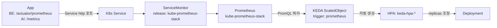

# KEDA 기반 RPS 오토스케일링

> 작성일: 2026-09-23 · 작성 브랜치: `feat/keda` · 담당: 클라우드 인프라

## 1. 개요

뭉치(MoongCheap)는 공동구매 플랫폼 특성상 마감 임박 시간대에 요청이 급격히 몰리는
트래픽 패턴을 가진다. CPU/메모리 기반 HPA는 이런 순간적인 RPS 급증에 반응이 느리고,
"요청량"이라는 실제 부하 지표를 직접 보지 못한다는 한계가 있다. 이를 보완하기 위해
**KEDA(Kubernetes Event-driven Autoscaling)** 를 도입하여, Prometheus에 적재되는
**초당 요청 수(RPS)** 를 기준으로 BE/AI 서비스를 오토스케일링한다.

- 스케일링 대상: **BE(backend), AI**. FE는 대상 아님(상시 트래픽을 직접 처리하는 백엔드성
  워크로드가 아니므로 제외).
- 적용 방식: 기존 `moongcheap-service` Helm 차트에 KEDA `ScaledObject`/`ServiceMonitor`
  템플릿을 추가하고, 서비스별 values 오버라이드에서 `keda.enabled: true`로 활성화.
- 현재 상태: BE는 실제 배포 환경에서 Prometheus 메트릭 노출을 curl로 직접 확인하고 설정을
  완료했고, AI는 설정은 완료했으나 ECR 이미지 미배포로 실측 검증은 다음 단계로 남아있다.

## 2. KEDA 동작 및 구조

### 2.1 KEDA란

KEDA는 쿠버네티스 기본 리소스인 HPA(HorizontalPodAutoscaler)를 대체하는 것이 아니라,
**HPA를 대신 만들어주고 그 HPA에 커스텀 메트릭을 공급해주는 컨트롤러**다.

- 사용자는 `ScaledObject`라는 CRD를 정의한다.
- KEDA 오퍼레이터는 이 `ScaledObject`를 보고, 내부적으로 `keda-hpa-<이름>`이라는 이름의
  일반 HPA 오브젝트를 자동으로 생성한다.
- KEDA의 메트릭 어댑터(metrics server)가 Prometheus 등 외부 소스에서 값을 가져와
  Kubernetes Custom/External Metrics API 형태로 변환해서 그 HPA에 공급한다.
- 즉 실제 스케일링 판단/실행 주체는 여전히 쿠버네티스 표준 HPA이고, KEDA는 "그 HPA가
  볼 수 있는 메트릭의 종류"를 CPU/Mem에서 Prometheus 쿼리 결과로 확장해주는 역할이다.

이 프로젝트에서는 여러 트리거 타입 중 **Prometheus 스케일러**를 사용한다. (이벤트 큐,
Cron 등 다른 트리거 타입도 있지만 이번 도입 범위 밖.)

### 2.2 이 프로젝트에서의 메트릭 흐름



각 단계가 끊기면 스케일링이 동작하지 않으므로, 문제가 생기면 이 체인을 앞에서부터 순서대로
점검한다 (자세한 커맨드는 4장 참고).

| 단계 | 무엇을 확인 | 이번 프로젝트 상태 |
|---|---|---|
| App | `/actuator/prometheus`, `/metrics` 가 실제로 텍스트 포맷 메트릭을 반환하는가 | BE: 실측 200 OK 확인 완료 / AI: 팀 curl로 확인(무인증, 8081) |
| Service | 메트릭 포트가 `http`라는 이름의 named port로 노출되는가 | 기존 서비스 포트 재사용 |
| ServiceMonitor | `release: kube-prometheus-stack` 라벨이 붙어 kube-prometheus-stack의 기본 `serviceMonitorSelector`에 매칭되는가 | 차트 템플릿에 라벨 하드코딩으로 반영 |
| Prometheus | Target이 `up`으로 잡히는가 | 다음 주 클러스터 검증 항목 |
| ScaledObject | PromQL 쿼리가 실제 라벨셋과 일치하는가 | BE는 실측 라벨로 쿼리 확정, AI는 팀 제공 라벨 기준 placeholder |

### 2.3 주요 파라미터와 오해하기 쉬운 부분

- **`pollingInterval`**: KEDA가 몇 초마다 Prometheus에 쿼리를 날려 메트릭을 갱신할지. 이 값이
  곧 스케일링 반응 속도의 하한이 된다. (현재 BE/AI 모두 15초)
- **`cooldownPeriod`**: 이건 **1 → 0, 즉 스케일 투 제로로 내려갈 때만 적용되는 대기 시간**이다.
  일반적인 축소(예: 5 → 3)에는 관여하지 않는다. 이번 설정은 `minReplicaCount`가 BE=2, AI=1로
  0이 아니므로, 사실상 scale-to-zero 경로 자체를 타지 않아 당장은 큰 의미가 없지만, 향후
  min을 0으로 낮추는 논의가 나올 경우를 대비해 300초로 설정해뒀다.
- **일반적인 확대/축소 속도를 실제로 제어하는 것은 `advanced.horizontalPodAutoscalerConfig.behavior`**
  (KEDA가 생성하는 HPA의 `behavior` 필드 그대로)다. 여기서 `scaleUp.stabilizationWindowSeconds`,
  `scaleDown.stabilizationWindowSeconds`와 각각의 `policies`(단위 시간당 몇 개/몇 %까지 늘리거나
  줄일지)를 지정한다. 현재 두 서비스 모두 "**늘릴 때는 즉시, 줄일 때는 신중하게**" 원칙으로
  scaleUp은 stabilizationWindow 0초, scaleDown은 300초로 비대칭 설정했다. 이는 과거 팀에서
  진행했던 부하테스트에서 관찰된 것과 동일한 패턴(아래 4.5절 참고)이며, 트래픽 튐에는 빠르게
  대응하고 노이즈성 하락에는 파드를 성급히 줄이지 않기 위함이다.
- **HPA와의 중복 방지**: `moongcheap-service` 차트는 원래 `autoscaling.enabled`(표준 HPA)를
  지원하고 있었다. KEDA와 표준 HPA를 동시에 켜면 같은 Deployment를 두 컨트롤러가 서로 다른
  replica 수로 맞추려고 경합하게 된다. 그래서 `keda.enabled: true`인 서비스는 반드시
  `autoscaling.enabled: false`로 둔다.
- **ArgoCD selfHeal과의 충돌 버그 수정**: `deployment.yaml`의 `replicas` 필드가 원래
  `autoscaling.enabled`일 때만 생략되도록 되어 있었다. `autoscaling.enabled: false` +
  `keda.enabled: true` 조합에서는 Deployment manifest에 `replicas`가 다시 박히게 되고,
  ArgoCD의 `selfHeal: true`가 주기적으로 이 값을 강제로 되돌려 KEDA가 조정한 replica 수를
  계속 리셋시키는 문제가 있었다. 이를 막기 위해 조건을 다음과 같이 수정했다.

  ```yaml
  {{- if not (or .Values.autoscaling.enabled .Values.keda.enabled) }}
  replicas: {{ .Values.replicaCount }}
  {{- end }}
  ```

## 3. KEDA 설정 방법 (현재 `feat/keda` 기준)

### 3.1 KEDA 오퍼레이터 설치

이 레포는 Helm 차트 설치가 필요한 플랫폼 컴포넌트를 `gitops/platform/<name>/{config.yaml,values.yaml}`
로 두면 `applicationset-platform.yaml`의 Git File Generator가 자동으로 인식하는 구조다.
(카펜터 컨트롤러, kube-prometheus-stack, jenkins, envoy-gateway와 동일한 패턴.) KEDA도 이
패턴을 그대로 따른다.

`gitops/platform/keda/config.yaml`
```yaml
name: keda
namespace: keda
helm:
  repoURL: https://kedacore.github.io/charts
  chart: keda
  version: 2.20.2
```

`gitops/platform/keda/values.yaml`
- `nodeSelector: { workload: system }` — 시스템 컴포넌트 노드 풀에 배치
- operator/metricServer/webhooks 각각 resources 지정
- KEDA 오퍼레이터 자체의 메트릭도 Prometheus로 수집하도록 `prometheus.operator.enabled` /
  `prometheus.metricServer.enabled` 옵션 활성화

### 3.2 서비스 공통 차트 (`gitops/charts/moongcheap-service`) 변경

- `templates/servicemonitor.yaml` (신규): `.Values.metrics.enabled`일 때만 생성. 서비스
  셀렉터 라벨은 기존 `selectorLabels` 재사용, `release: kube-prometheus-stack` 라벨 필수
  (없으면 kube-prometheus-stack 기본 `serviceMonitorSelector`에 안 걸림).
- `templates/scaledobject.yaml` (신규): `.Values.keda.enabled`일 때만 생성. `minReplicaCount`,
  `maxReplicaCount`, `pollingInterval`, `cooldownPeriod`, `advanced`(behavior), `triggers`
  (Prometheus 타입, `serverAddress`/`query`/`threshold`/선택적 `activationThreshold`)를 values로
  받아 렌더링.
- `templates/deployment.yaml` (수정): 위 2.3절의 HPA/KEDA 충돌 방지 조건 반영.
- `values.yaml` (수정): 서비스 차트 기본값으로 `metrics.enabled: false`, `keda.enabled: false`
  블록 추가 — **모든 서비스는 기본적으로 KEDA 비활성 상태이고, 필요한 서비스만 오버라이드에서
  명시적으로 켠다.**

### 3.3 BE 설정 (실측 완료)

`gitops/values/overrides/develop/backend.yaml`

- `autoscaling.enabled: false`
- `metrics.enabled: true`, `path: /actuator/prometheus`
- ```yaml
  keda:
    enabled: true
    minReplicaCount: 2
    maxReplicaCount: 8
    pollingInterval: 15
    cooldownPeriod: 300
    advanced:
      horizontalPodAutoscalerConfig:
        behavior:
          scaleUp:
            stabilizationWindowSeconds: 0
            policies: [{type: Percent, value: 100, periodSeconds: 15}]
          scaleDown:
            stabilizationWindowSeconds: 300
            policies: [{type: Pods, value: 1, periodSeconds: 60}]
    triggers:
      - serverAddress: http://kube-prometheus-stack-prometheus.monitoring.svc:9090
        query: 'sum(rate(http_server_requests_seconds_count{service="backend", namespace="moongcheap-develop", uri!="/actuator/health"}[1m]))'
        threshold: "50"
  ```

`https://api.moongcheap.shop/actuator/prometheus`에 직접 curl로 확인하여 실제 노출되는 메트릭이
Micrometer 표준 이름인 `http_server_requests_seconds_count{application, method, uri, status,
outcome, exception, error}`임을 확인했고, 그 라벨셋 기준으로 쿼리를 확정했다. `uri!="/actuator/health"`
로 헬스체크 노이즈를 제외했고, 추후 prod 분리를 대비해 `namespace` 라벨 필터를 넣었다.

> **참고**: 위 threshold `50`은 실제 부하테스트로 검증되지 않은 임시값이다. 4장의 테스트로
> 확정 예정.

### 3.4 AI 설정 (설정 완료, 실측은 다음 단계)

`gitops/values/overrides/develop/ai.yaml`

- `image.tag: "develop"`
- `autoscaling.enabled: false`
- `metrics.enabled: true`, `path: /metrics`
- ```yaml
  keda:
    enabled: true
    minReplicaCount: 1
    maxReplicaCount: 4
    pollingInterval: 15
    cooldownPeriod: 300
    advanced: # BE와 동일한 scaleUp/scaleDown 형태
    triggers:
      - serverAddress: http://kube-prometheus-stack-prometheus.monitoring.svc:9090
        query: 'sum(rate(http_requests_total{service="ai", namespace="moongcheap-develop", path!="/health"}[1m]))'
        threshold: "20"
  ```

AI팀이 curl로 확인해 준 실제 노출 메트릭(`http_requests_total{method, path, status}`, 8081,
무인증)을 기준으로 쿼리를 작성했다. BE 대비 `minReplicaCount`/`maxReplicaCount`를 작게 잡은
이유는 아직 실제 트래픽으로 검증된 적 없는 서비스라 보수적으로 시작하기 위함이다.

**AI는 이번 PR에 포함되지만 이 설정만으로 파드가 뜨지는 않는다.** ECR에 이미지가 아직 푸시되지
않아 이미지 pull이 실패하는 상태이기 때문이다. KEDA는 `minReplicaCount`만큼 대기하는 상태로
머무르며, 이 자체가 클러스터에 위험을 주지는 않는다. 아래 항목은 이번 PR 범위 밖이며 실제
테스트 전 별도로 진행되어야 한다.

- AI 서비스 ECR 이미지 push
- `containerPort` 수정(`8000` → `8081`, 실제 이미지 포트와 불일치 확인됨) — **이 수정은
  인프라팀이 아니라 서비스를 배포하는 담당자가 진행할 사항**이라 이번 커밋/PR에 포함하지
  않았다. 별도로 담당자에게 전달 필요.
- `readinessProbe` 활성화(`/health` 경로)
- `SELLER_ANALYSIS_INTERNAL_KEY` / `BACKEND_INTERNAL_API_KEY` 시크릿 반영 (PR #36 참고)

## 4. 테스트 방식

서비스 안정화 후 실제 클러스터에서 진행할 검증 절차다. 이전 프로젝트에서 KEDA/Karpenter
조합으로 k6 부하테스트를 진행했던 방식을 기반으로, 이번 프로젝트 구조(Prometheus 스케일러,
behavior 비대칭 설정)에 맞게 재구성했다.

### 4.1 목적

1. `keda-hpa-*`가 실제로 생성되고 Prometheus 메트릭을 정상적으로 공급받는지 확인 (기능 검증)
2. 현재 placeholder인 threshold(BE 50, AI 20)를 **파드 1개가 감당 가능한 실측 최대 RPS의
   50~60% 수준**으로 재산정 (용량 검증)
3. scaleUp/scaleDown behavior가 의도대로 "빠르게 늘고 신중하게 준다"로 동작하는지 확인
   (동작 검증)
4. 오토스케일링 적용 전/후 비교를 통해 실제 효과(응답 지연, 실패율, 필요 시 비용) 정리

### 4.2 사전 준비

- 서비스별 ApplicationSet(`applicationset-services-develop.yaml`)이 기본적으로 `develop`
  브랜치를 보고 있으므로, `feat/keda`의 변경을 테스트 클러스터에 반영하려면 테스트 기간 동안
  임시로 revision을 전환한다.

  ```bash
  argocd app set <app-name> --revision feat/keda
  # 테스트 종료 후 반드시 원복
  argocd app set <app-name> --revision develop
  ```

- k6는 로컬 실행 대신, 클러스터 내부 네트워크(Envoy Gateway 경유가 아닌 Service 직결)로
  때리는 것을 기본으로 한다. 이렇게 해야 Gateway/네트워크 구간 변수를 배제하고 순수하게
  파드/오토스케일링 동작만 측정할 수 있다.

  ```bash
  kubectl run k6-runner --rm -it --restart=Never \
    --image=grafana/k6 -- run - < loadtest.js
  ```

### 4.3 1단계 — 단일 파드 한계치(breaking point) 측정

KEDA threshold를 정하려면 먼저 "파드 1개가 감당 가능한 최대 RPS"를 알아야 한다. 이전 팀에서
사용했던 방식대로, **일시적으로 replica를 1개로 고정하고 resources.limits를 제거(또는 크게
완화)한 상태**에서 부하를 점진적으로 올려 한계를 찾는다.

- 확인할 신호(아래 중 먼저 발생하는 것이 그 파드의 실질적 한계):
  - CPU 사용률이 더 이상 처리량 증가로 이어지지 않고 평평해지는 지점 (CPU-bound)
  - p95/p99 레이턴시가 급격히 튀는 지점 (처리 지연)
  - 메모리 사용량이 계속 증가하다 OOMKilled 발생 (Mem-bound)
  - DB/커넥션 풀 관련 에러 응답 발생 (연결 자원 고갈)
- k6 스크립트는 **VU(가상 유저) 기반 `stages`가 아니라 `ramping-arrival-rate` executor**를
  사용한다. 이유: 이 테스트의 목적 지표는 "동시 접속자 수"가 아니라 "초당 요청 수(RPS)"이고,
  KEDA 트리거도 RPS 쿼리이기 때문에 실제로 밀어넣는 부하 단위와 판단 기준 단위를 일치시켜야
  결과가 의미 있다. VU 기반 stages는 응답이 느려지면 자동으로 초당 요청 수가 줄어들어 버려서
  "얼마나 밀어붙였을 때 한계였는지"를 왜곡한다.

  ```javascript
  import http from 'k6/http';

  export const options = {
    scenarios: {
      rps_ramp: {
        executor: 'ramping-arrival-rate',
        startRate: 10,
        timeUnit: '1s',
        preAllocatedVUs: 200,
        maxVUs: 500,
        stages: [
          { target: 50, duration: '1m' },
          { target: 100, duration: '2m' },
          { target: 200, duration: '2m' },
          { target: 400, duration: '2m' },
          { target: 800, duration: '2m' }, // 한계에 도달할 때까지 필요 시 단계 추가
        ],
      },
    },
    thresholds: {
      http_req_duration: ['p(95)<500'], // 서비스별 SLA에 맞게 조정
      http_req_failed: ['rate<0.01'],
    },
  };

  export default function () {
    http.get('http://backend.moongcheap-develop.svc.cluster.local/actuator/health');
  }
  ```

- 이렇게 얻은 "파드 1개 최대 RPS" 값의 **약 50~60%를 KEDA threshold로 채택**한다. (예:
  이전 프로젝트 사례에서는 파드 최대 660 RPS 측정 → threshold 400으로 설정, 약 61.5% 수준.)
  너무 낮게 잡으면 불필요하게 자주 스케일 아웃하고, 너무 높게 잡으면 반응이 늦어 순간
  트래픽에 지연이 생긴다.
- 동시에 이 단계에서 관찰한 실제 CPU/메모리 사용량 + 여유분을 기준으로 Pod의
  `resources.requests/limits`도 재산정할 수 있으면 함께 정리한다.

### 4.4 2단계 — KEDA 적용 상태에서 종합 시나리오 테스트

1단계에서 threshold를 잠정 확정했다면, 실제 `keda.enabled: true` 상태(오토스케일링 켜진
상태)에서 아래 시나리오로 검증한다.

- **베이스라인 구간**: 낮은 RPS로 몇 분간 유지, `minReplicaCount`에서 안정적으로 서비스되는지
  확인.
- **급증 구간**: 짧은 시간에 RPS를 급격히 올려(예: 마감 임박 시나리오 재현) scale-up이 얼마나
  빨리 반응하는지 확인. `scaleUp.stabilizationWindowSeconds: 0` 설정대로 지연 없이 반응해야
  한다.
- **고점 유지 구간**: 늘어난 replica 수가 트래픽을 안정적으로 처리하는지, HPA가 계속
  적정 수준으로 유지하는지 확인.
- **감소 구간**: 부하를 끊거나 낮춘 뒤, `scaleDown.stabilizationWindowSeconds: 300` 설정대로
  바로 줄어들지 않고 5분의 관찰 구간을 거쳐 신중하게 축소되는지 확인. 이전 팀 테스트에서는
  전체 부하가 끊긴 후 약 5분 뒤 베이스라인 replica 수로 완전히 복귀하는 패턴이 관찰된 바 있다.
- 위 시나리오를 한 번 더, **부하를 두 번(예: 3분 간격으로) 연속으로 주는 케이스**로도
  진행해서 "이미 늘어난 상태에서 추가로 더 늘어나는지", "축소 타이머가 새 부하로 인해 다시
  리셋되는지"를 확인한다. (과거 사례: vu300 → 3분 뒤 vu900 추가 투입 시 6 pod → 9 pod까지
  단계적으로 늘어나는 것을 확인.)

### 4.5 모니터링/확인 커맨드

```bash
# ScaledObject 상태 및 현재 활성 여부
kubectl get scaledobject -n moongcheap-develop
kubectl describe scaledobject <name> -n moongcheap-develop

# KEDA가 생성한 HPA 실시간 관찰
kubectl get hpa -n moongcheap-develop -w

# Pod 수/리소스 사용량 실시간 관찰
kubectl get pods -n moongcheap-develop -l app.kubernetes.io/name=backend -w
kubectl top pods -n moongcheap-develop

# Karpenter가 노드까지 함께 늘리는지 확인
kubectl get nodes -w
kubectl get nodeclaims

# Prometheus에서 실제 트리거 쿼리 값 확인 (Prometheus UI 또는 port-forward)
kubectl port-forward -n monitoring svc/kube-prometheus-stack-prometheus 9090:9090
# → 브라우저에서 ScaledObject에 넣은 쿼리를 그대로 실행해 threshold와 비교
```

### 4.6 성공 기준 (제안)

| 항목 | 기준(초안) |
|---|---|
| 요청 성공률 | 부하 전 구간에서 `http_req_failed rate < 1%` |
| 응답 지연 | 스케일 아웃 반응 이전의 짧은 구간을 제외하면 `p(95) < 500ms` (서비스별 조정 가능) |
| Scale-up 반응성 | 임계치 초과 후 1 polling interval(15s) + 1 stabilization window(0s) 이내 HPA desired replica 증가 시작 |
| Scale-down 안정성 | 부하 종료 후 최소 5분(cooldown/stabilization window) 동안은 replica 급격히 감소하지 않음 |

이 기준과 실측 결과는 테스트 후 이 문서 또는 별도 결과 문서에 업데이트한다.

### 4.7 정리(cleanup)

테스트로 임시로 늘려둔 리소스/파드가 남아있지 않도록 마무리한다.

```bash
# ApplicationSet revision 원복
argocd app set <app-name> --revision develop

# 남은 k6 runner 파드 정리
kubectl delete pod k6-runner -n <namespace> --ignore-not-found

# 필요 시 임계치 조정 등 실제 반영은 반드시 feat/keda(또는 후속 PR)를 통해 Git으로 반영
# (클러스터에서 kubectl edit으로 직접 고치고 끝내지 않기 — GitOps 원칙 위반)
```

## 5. 알려진 제약 사항 / TODO

- BE: 실제 배포된 이미지가 `develop` 브랜치 HEAD 소스와 정확히 일치하지 않는 것으로 보임
  (소스 기준으로는 아직 `micrometer-registry-prometheus` 의존성이 안 보이는데 실제 응답은
  정상 노출됨). 기능상 문제는 없으나, BE 쪽에 정식 develop 반영 여부 확인 필요.
- AI: ECR 이미지 미배포, `containerPort` 불일치(서비스 배포 담당자 조치 필요), 내부 API
  시크릿(PR #36) 미반영 — 실제 클러스터 검증 전 선행되어야 함.
- BE/AI threshold 모두 placeholder. 4장의 부하테스트 결과로 확정 예정.
- Envoy Gateway 라우팅이 `api.moongcheap.shop`의 `/`를 전부 backend로 넘기고 있어
  `/actuator/health`, `/actuator/prometheus`가 외부에 그대로 노출된다. 당장 KEDA 동작에는
  문제 없지만, 추후 인증/경로 제한 등 보안 강화 논의가 필요할 수 있음(이번 PR 범위 밖).
- Scale-to-zero는 이번 설정에서 사용하지 않음(minReplicaCount ≥ 1). 향후 필요 시
  `cooldownPeriod`의 실제 동작 범위(1→0 전환에만 적용)를 다시 고려해야 함.

## 6. 참고 자료

- [KEDA 공식 문서 - Prometheus Scaler](https://keda.sh/docs/latest/scalers/prometheus/)
- [KEDA 공식 문서 - ScaledObject Spec](https://keda.sh/docs/latest/concepts/scaling-deployments/)
- 팀 이전 프로젝트에서 진행한 KEDA/Karpenter 부하테스트 방법론 및 결과 (Notion, 내부 자료) —
  파드 최대 처리량 측정 → threshold 산정 → scaleUp/scaleDown 비대칭 behavior 검증 → 2차에
  걸친 단계적 부하 재현 테스트로 구성된 방법론을 이번 프로젝트 구조에 맞게 재구성해 4장에
  반영함.